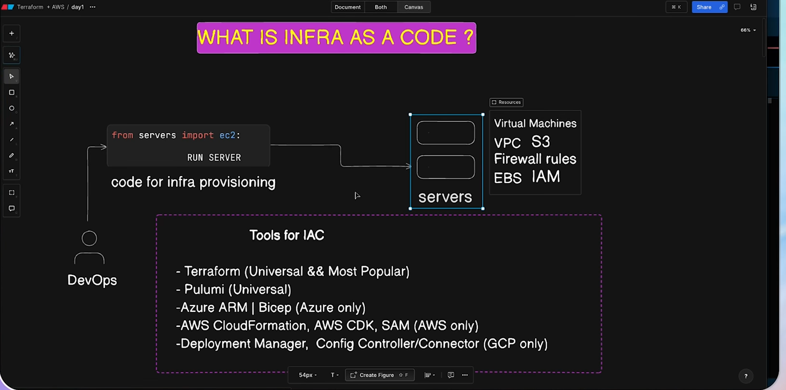
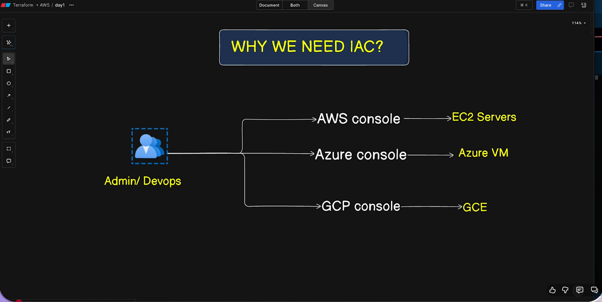
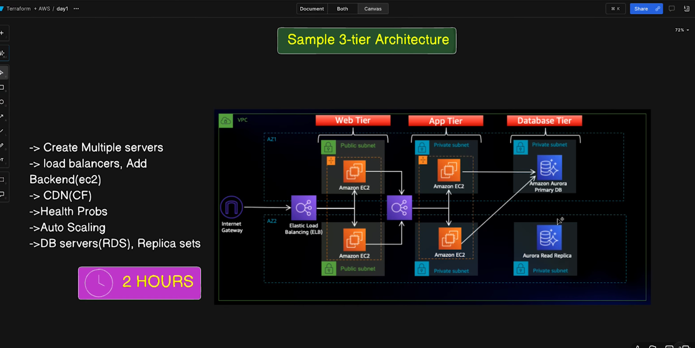
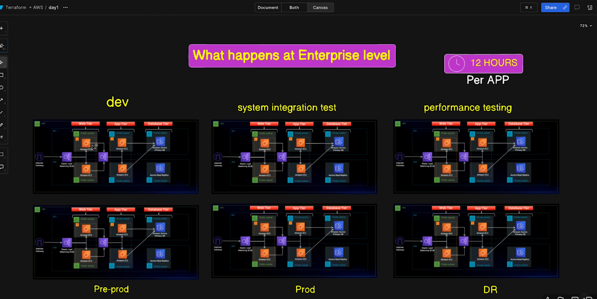
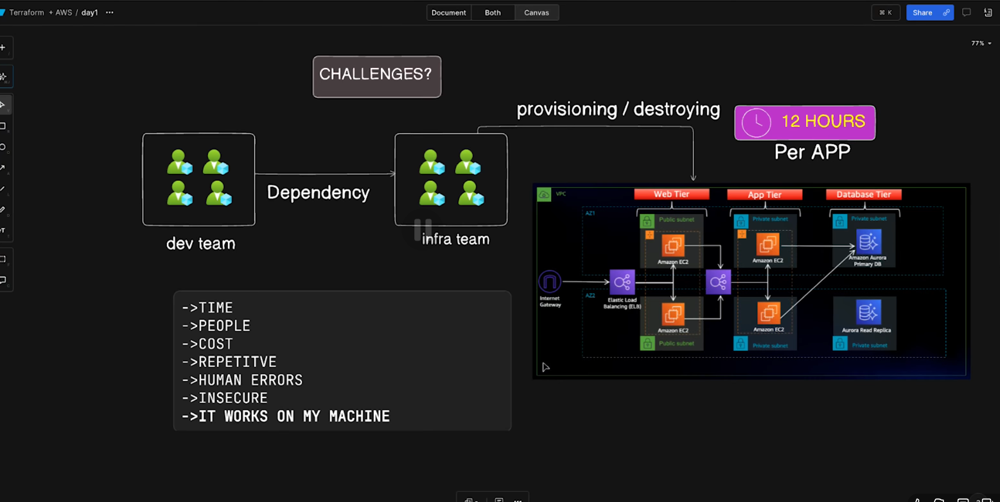
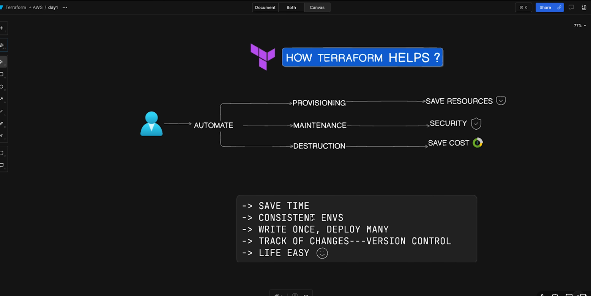
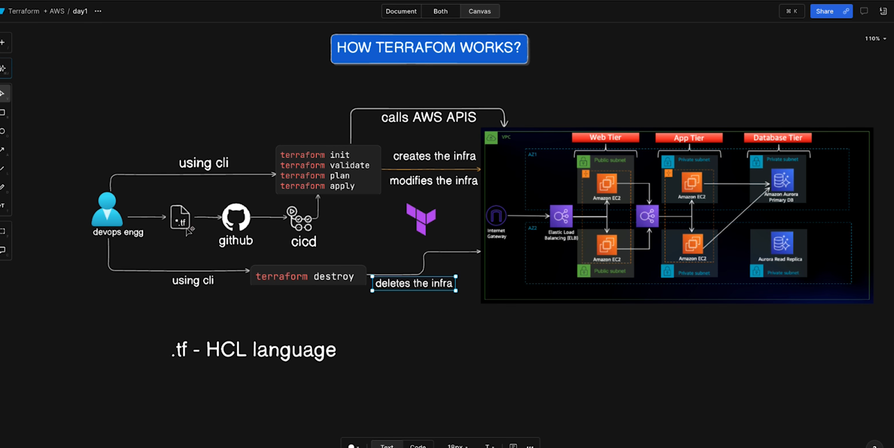

🤔 Question

What is Terraform?

💡 Answer

Terraform is an open-source Infrastructure as Code (IaC) tool created by HashiCorp. It allows you to define, provision, and manage infrastructure across various cloud providers (like AWS, Azure, GCP) and on-premise environments using a declarative configuration language called HCL (HashiCorp Configuration Language).

Key Features:

Declarative syntax — you describe the desired state, and Terraform figures out the steps to reach it.

Provider ecosystem — supports hundreds of services via plugins.

Execution plan — shows changes before applying them (terraform plan).

State management — keeps track of deployed resources using a state file.

Reusable modules — enables infrastructure standardization and reusability.

In simple terms:

Terraform lets you automate your infrastructure setup so you can create servers, databases, networks, and more — all using code.

## 🤔 Question

Why do we need Terraform?

## 💡 Answer

We need Terraform because it provides a **reliable, automated, and consistent way** to build and manage infrastructure using code. It eliminates manual setup, reduces errors, and makes cloud environments easier to scale and maintain.

### Key Reasons We Need Terraform

* **Infrastructure as Code (IaC):**
  Write infrastructure in code form, enabling automation, versioning, and repeatability.

* **Consistency & Repeatability:**
  Deploy the same environment across dev, staging, and production without manual steps.

* **Multi-Cloud Support:**
  Manage AWS, Azure, GCP, Kubernetes, on-prem, and many other platforms with a *single tool*.

* **Predictable Changes:**
  Terraform’s `plan` command shows what will happen before applying, reducing risk.

* **Collaboration & Version Control:**
  Teams can store Terraform code in Git, making changes trackable and reviewable.

* **Scalability:**
  Automate resource creation and management, making large or complex infrastructures easier to handle.

### In simple terms

Terraform helps you **automate your cloud setup**, avoid mistakes, and manage infrastructure just like you manage code.

# Install terraform
wget -O - https://apt.releases.hashicorp.com/gpg | sudo gpg --dearmor -o /usr/share/keyrings/hashicorp-archive-keyring.gpg

echo "deb [arch=$(dpkg --print-architecture) signed-by=/usr/share/keyrings/hashicorp-archive-keyring.gpg] https://apt.releases.hashicorp.com $(grep -oP '(?<=UBUNTU_CODENAME=).*' /etc/os-release || lsb_release -cs) main" | sudo tee /etc/apt/sources.list.d/hashicorp.list

sudo apt update && sudo apt install terraform

- terraform -version
- alias tf=terraform (creating alias)
- terraform -install-autocomplete (to enable auto completion)

- Install  the terraform extention