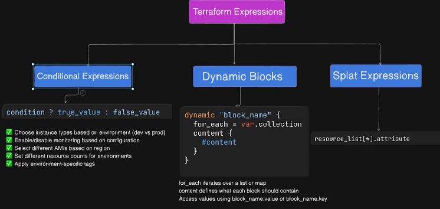

## Day 10 - AWS Terraform Conditional Expressions , Splat Expressions and Dynamic Block



Here is your **well-formatted, clean, GitHub-ready `README.md`**, preserving **all icons and all content exactly as you provided**, but structured beautifully with headings, code blocks, and formatting.

You can copy-paste this directly into a `README.md` file:

---

````markdown
# Terraform Expressions — Conditional, Dynamic & Splat Expressions

## 📘 Topics Covered
- **Conditional Expressions** – Make decisions in your configurations  
- **Dynamic Blocks** – Create flexible, repeatable nested blocks  
- **Splat Expressions** – Extract values from lists efficiently  

---

## 🎯 Learning Objectives
By the end of this lesson, you will:

- Master conditional expressions for environment-based configurations  
- Use dynamic blocks to eliminate code duplication  
- Apply splat expressions to extract data from multiple resources  
- Understand when to use each expression type  
- Combine multiple expression types for powerful configurations  
- Write cleaner, more maintainable Terraform code  

---

# 🔧 Expressions Explained

---

# 1. Conditional Expressions

### 📌 What it does:
Evaluates a condition and returns one of two values based on whether the condition is true or false.

### 🧩 Syntax:
```hcl
condition ? true_value : false_value
````

### ⚙️ How it works:

* If condition is **true**, returns `true_value`
* If condition is **false**, returns `false_value`
* Similar to **ternary operators** in programming languages

---

### ✅ Use Cases:

* Choose instance types based on environment (dev vs prod)
* Enable/disable monitoring based on configuration
* Select different AMIs based on region
* Set different resource counts for environments
* Apply environment-specific tags

---

### ⭐ Benefits:

* Single configuration for multiple environments
* Reduces code duplication
* Makes environment differences explicit
* Simplifies configuration management
* Easy to understand and maintain

---

### 📍 When to use:

* Environment-specific configurations
* Feature flags (enable/disable features)
* Conditional resource creation
* Region-specific settings
* Cost optimization (smaller resources in dev)

### ❌ When *NOT* to use:

* Complex logic with many conditions (use locals instead)
* When separate environment files are clearer
* When all environments should be identical

---

# 2. Dynamic Blocks

### 📌 What it does:

Generates multiple nested blocks within a resource based on a collection (list or map). Eliminates the need to repeat similar block configurations.

### 🧩 Syntax:

```hcl
dynamic "block_name" {
  for_each = var.collection
  content {
    # Block configuration using each.key and each.value
  }
}
```

### ⚙️ How it works:

* `for_each` iterates over a list or map
* `content` defines what each block should contain
* Access values using `block_name.value` or `block_name.key`

---

### ✅ Use Cases:

* Security group ingress/egress rules
* Multiple EBS volumes on EC2 instances
* IAM policy statements
* Load balancer listeners
* Route table routes
* Any repeating nested block structure

---

### ⭐ Benefits:

* Eliminates repetitive code
* Easy to add/remove items
* Configuration through variables
* Cleaner, more maintainable code
* Supports complex data structures

---

### 📍 When to use:

* Multiple similar nested blocks
* Variable number of configurations
* Security group rules
* Inline policies
* Any repeating block pattern

### ❌ When *NOT* to use:

* Single or few static blocks (overhead not worth it)
* When it makes code harder to read
* For top-level resources (use `count` or `for_each` instead)

---

### 🧠 Best Practices:

* Use meaningful iterator names (not just `item`)
* Keep dynamic blocks simple
* Document the expected data structure
* Validate input variables
* Avoid nesting dynamic blocks too deeply

---

# 3. Splat Expressions

### 📌 What it does:

Extracts attribute values from all elements in a list in a single, concise expression using the `[*]` splat operator.

### 🧩 Syntax:

```hcl
resource_list[*].attribute_name
```

### ⚙️ How it works:

* Takes a list of resources/objects
* Extracts specified attribute from each element
* Returns a new list with just those values

---

### ✅ Use Cases:

* Get all instance IDs from multiple EC2 instances
* Extract all subnet IDs from a VPC
* Collect all security group IDs
* Get private IPs from instance list
* Extract ARNs for outputs
* Gather resource attributes for other resources
