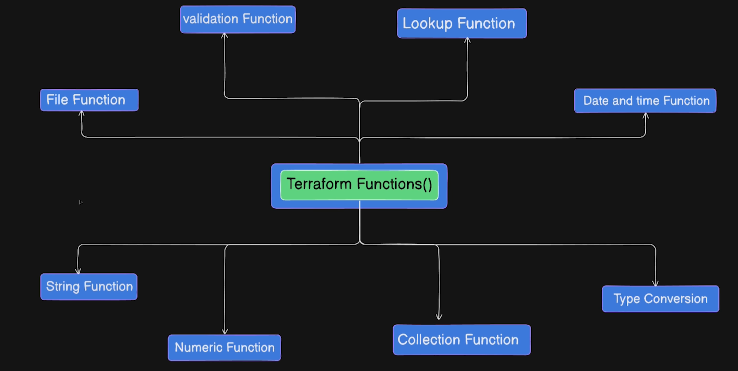

## Day-11 | AWS Terraform Functions - Part 1

- Function allow us to wrap up the repitive tasks and call them when we want to use.
- no custom functions but it has a lot of inbuilt function.
- terraform refresh
- terraform init -upgrade



1. Validation fn
2. Lookup fn
3. Date and Time fn
4. File fn
5. String fn
6. Numeric fn
7. Collection fn
8. Type  Conversion fn

# To switch to terraform shell 
- type =>  terraform console

# String fn
- upper("string") -> STRING
- lower("STRING") -> string
- trim("  adarsh  "," ") -> "adarsh" (remove the specified character)
- replace("hello adarsh"," ","-") -> "hello-adarsh"
- substr("adarsh",0,3) -> "ada"


# Numeric fn
- max(34,2,24) -> 34
- min(34,2,24) -> 2
- abs(-45) -> 45

# Collection fn
- length([1,3,4]) -> 3
- concat([1,2],[56,45]) -> [1,2,56,45] -> list/tuple
-  merge({a=1},{b=24}) -> { "a" = 1 "b" = 24} -> tuple
- split("1,2,3,4",",") -> [1,2,3,4]

# Type Conversion fn
- toset(["a","b","a"]) -> toset(["a","b"])
- tonumber("23") -> 23
- tostring(34) -> "34"


# Date and Time fn
- timestamp() -> "2025-12-06T13:25:23Z"
- formatdate("DD-MM-YY",timestamp()) -> "06-12-25"


---

# Terraform Functions – Comprehensive Learning Guide

This two-day module covers Terraform's built-in functions through 12 hands-on assignments. Each assignment focuses on specific functions and real-world use cases.

For step-by-step demo instructions, refer to **DEMO_GUIDE.md**.

---

## Learning Objectives

By the end of this module, you will:

* Master Terraform's built-in functions across all categories
* Understand when and how to use each function type
* Combine multiple functions effectively
* Use the Terraform console for testing
* Implement validation and error handling
* Handle sensitive data securely
* Create dynamic and reusable configurations

---

## Terraform Console Commands

Practice these fundamental commands in the Terraform console before starting the assignments:

```
lower("HELLO WORLD")
max(5, 12, 9)
trim("  hello  ")
chomp("hello\n")
reverse(["a", "b", "c"])
```

---

## Assignments Overview

| #  | Assignment            | Functions              | Difficulty | AWS Resources   |
| -- | --------------------- | ---------------------- | ---------- | --------------- |
| 1  | Project Naming        | lower, replace         | ⭐          | Resource Group  |
| 2  | Resource Tagging      | merge                  | ⭐          | VPC             |
| 3  | S3 Bucket Naming      | substr, replace, lower | ⭐⭐         | S3 Bucket       |
| 4  | Security Group Ports  | split, join, for       | ⭐⭐         | Security Group  |
| 5  | Environment Lookup    | lookup                 | ⭐⭐         | EC2 Instance    |
| 6  | Instance Validation   | length, can, regex     | ⭐⭐⭐        | EC2 Instance    |
| 7  | Backup Configuration  | endswith, sensitive    | ⭐⭐         | None            |
| 8  | File Path Processing  | fileexists, dirname    | ⭐⭐         | None            |
| 9  | Location Management   | toset, concat          | ⭐          | None            |
| 10 | Cost Calculation      | abs, max, sum          | ⭐⭐         | None            |
| 11 | Timestamp Management  | timestamp, formatdate  | ⭐⭐         | S3 Bucket       |
| 12 | File Content Handling | file, jsondecode       | ⭐⭐⭐        | Secrets Manager |


---

## Function Categories

### String Functions

* lower()
* upper()
* replace()
* substr()
* trim()
* split()
* join()
* chomp()

### Numeric Functions

* abs()
* max()
* min()
* ceil()
* floor()
* sum()

### Collection Functions

* length()
* concat()
* merge()
* reverse()
* toset()
* tolist()

### Type Conversion

* tonumber()
* tostring()
* tobool()
* toset()
* tolist()

### File Functions

* file()
* fileexists()
* dirname()
* basename()

### Date/Time Functions

* timestamp()
* formatdate()
* timeadd()

### Validation Functions

* can()
* regex()
* contains()
* startswith()
* endswith()

### Lookup Functions

* lookup()
* element()
* index()

---

## File Structure

* **README.md** – Overview of the module
* **DEMO_GUIDE.md** – Step-by-step demo instructions
* **provider.tf** – AWS provider setup
* **backend.tf** – S3 backend configuration (optional)
* **variables.tf** – Variables for all assignments
* **main.tf** – All 12 assignments (structured and commented)
* **outputs.tf** – Outputs for each assignment (commented)

---

## Assignment Summary

### Assignment 1: Project Naming (⭐)

Transform `"Project ALPHA Resource"` to `"project-alpha-resource"`
Functions used: `lower()`, `replace()`
Status: Active by default

### Assignment 2: Resource Tagging (⭐)

Merge default and environment-specific tags
Function used: `merge()`

### Assignment 3: S3 Bucket Naming (⭐⭐)

Create AWS-compliant bucket names
Functions used: `substr()`, `replace()`, `lower()`

### Assignment 4: Security Group Ports (⭐⭐)

Convert `"80,443,8080"` into ingress rules
Functions used: `split()`, `join()`, `for`

### Assignment 5: Environment Lookup (⭐⭐)

Dynamically select EC2 instance size
Function used: `lookup()`

---
