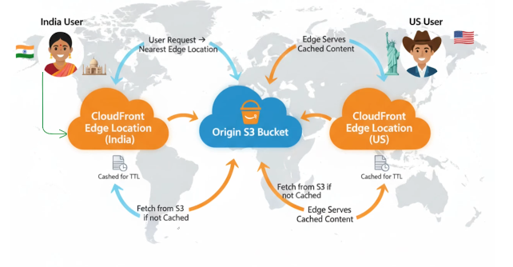
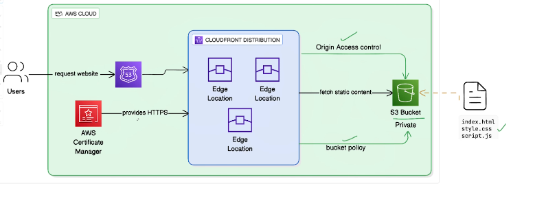

## Day-14  | Host A Static Website In AWS S3 And Cloudfront (using terraform)

Here’s a clean, simple, and clear explanation of **why CloudFront + S3** is the ideal combo for serving a **global static website**:

---

# **Importance of Using AWS CloudFront Edge with S3 to Serve a Static Website Globally**

When hosting a static website on **Amazon S3**, the files (HTML, CSS, JS, images, videos) are stored in an S3 bucket located in a **single AWS Region**. While this works, it may not give the best experience for users who are physically far from that region.

This is where **Amazon CloudFront**, AWS’s global Content Delivery Network (CDN), becomes essential.

---

## 🔥 **1. Ultra-Low Latency via Global Edge Locations**

CloudFront has **hundreds of edge locations** across the world.

* When a user visits your website, CloudFront serves the content from the **nearest edge location**, not from your original S3 bucket in (example) Mumbai or Virginia.
* This reduces round-trip time significantly.
* Faster loading = Better user experience and SEO benefits.

**Without CloudFront:**
User in Europe → Request goes directly to your S3 bucket in AP-South-1 → Slow

**With CloudFront:**
User in Europe → Request goes to EU edge location → Served from nearest cache → Very fast

---

## ⚙️ **2. Caching for High Performance & Cost Efficiency**

CloudFront caches your static files in edge locations. Benefits:

* Reduces load on your S3 bucket
* Faster response times
* Lower S3 data transfer cost
* Better handling of high traffic spikes (no S3 overload)

CloudFront is built to serve heavy loads—great for viral traffic.

---

## 🔐 **3. Better Security for Your Website**

CloudFront adds multiple layers of security:

### ✔️ **AWS WAF Integration (Web Application Firewall)**

Protects against:

* SQL Injection
* XSS
* Bot traffic
* DDoS attempts

### ✔️ **DDoS Protection via AWS Shield**

Automatically included. Protects your site at both edge locations and origin (S3).

### ✔️ **Origin Access Control (OAC)**

Ensures S3 bucket is **not publicly accessible**.

Only CloudFront can access your S3 content → prevents unauthorized downloads.

---

## 🌍 **4. Global Scalability & Reliability**

CloudFront is deployed worldwide with AWS’s massive global network.

Even during:

* High traffic
* Spikes from marketing campaigns
* Regional internet disruptions

Your site stays stable, fast, and highly available.

---

## 🔒 **5. HTTPS Everywhere (Free SSL)**

CloudFront provides **free TLS/SSL certificates** via AWS Certificate Manager.

Benefits:

* Secure communication
* Browsers trust your site (no “Not Secure” warning)
* SEO boost
* S3 alone cannot provide HTTPS without CloudFront

---

## 🧭 **6. URL Routing, Custom Domains & Better Control**

CloudFront allows:

* Custom domains ([www.example.com](http://www.example.com))
* URL rewrites / redirects
* Custom error pages
* Cache policies
* Versioning with query parameters

This gives you much more flexibility than serving directly from S3.

---

# 🚀 **Final Summary**

| Feature        | S3 Only                         | S3 + CloudFront              |
| -------------- | ------------------------------- | ---------------------------- |
| Global speed   | ❌ Slow for distant users        | ✅ Fast via edge locations    |
| Caching        | ❌ None                          | ✅ Strong global caching      |
| Security       | ❌ Public bucket, basic security | ✅ WAF, Shield, OAC           |
| Scalability    | ⚠️ Good but limited             | ✅ Global CDN scaling         |
| HTTPS          | ❌ Hard/limited                  | ✅ Free SSL certificates      |
| Domain support | ⚠️ Limited                      | ✅ Full custom domain support |

**➡️ For any production static website, using S3 + CloudFront is the industry best practice.**

---

