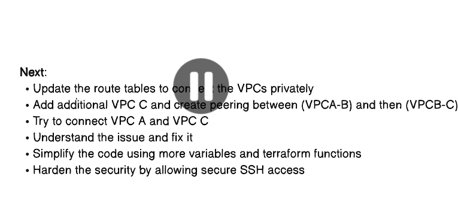

## Day-15 | AWS VPC Peering Using Terraform - Mini project


**VPC Peering** is a **networking feature** that lets **two Virtual Private Clouds (VPCs) communicate with each other privately** using **private IP addresses**, as if they were on the same network.

---

## In simple terms

VPC Peering creates a **direct, private connection** between two VPCs so that resources (like EC2 instances, databases, services) in one VPC can **talk to resources in another VPC securely**.

No internet, no VPN, no NAT required.

---

## Key characteristics

### 🔹 Private & secure

* Traffic stays on the **cloud provider’s internal network**
* **No public IPs** needed
* Lower latency and higher bandwidth

### 🔹 One-to-one connection

* Peering is **not transitive**

  * If VPC A ↔ VPC B
  * and VPC B ↔ VPC C
    ❌ VPC A cannot talk to VPC C automatically

### 🔹 Works across:

* Same account
* Different accounts
* Same region or **different regions** (inter-region peering, supported in AWS)

---

## Example (AWS)

Imagine:

* **VPC A** → Web servers
* **VPC B** → Database

With VPC Peering:

* Web servers in VPC A can access the database in VPC B using **private IPs**
* No exposure to the internet

---

## Common use cases

* Separating **prod and dev** environments
* Sharing **common services** (auth, logging, monitoring)
* Connecting **microservices** across VPCs
* Secure access to databases in another VPC

---

## Requirements / Limitations

* **CIDR blocks must not overlap**
* You must update:

  * Route tables
  * Security groups / NACLs
* No traffic inspection or NAT in peering
* No transitive routing

---

## VPC Peering vs VPN vs Transit Gateway

| Feature            | VPC Peering       | VPN              | Transit Gateway |
| ------------------ | ----------------- | ---------------- | --------------- |
| Internet required  | ❌ No              | ✅ Yes            | ❌ No            |
| Transitive routing | ❌ No              | ❌ No             | ✅ Yes           |
| Scalability        | Low               | Medium           | High            |
| Use case           | Simple VPC-to-VPC | On-prem to cloud | Hub-and-spoke   |

---



# Transitive peering
-  If there is VPC peering between: VPC-A <-> VPC-B and VPC-B <-> VPC-C. Then, it doesn't means that there is also peering between VPC-A and VPC-C. 
- VPC-peering is not transitive in nature.


Perfect 👍
Here is the **complete, corrected, and well-formatted `README.md` in a single Markdown file**, ready to use directly.

---

```md
# 🌐 AWS VPC Peering – Multi-Region Demo (Terraform)

## Overview
This demo showcases **AWS VPC Peering** by creating **two VPCs in different AWS regions** and establishing a **cross-region VPC peering connection** between them.  
Resources in both VPCs can communicate **securely using private IP addresses**, without traversing the public internet.

---

## Architecture

```

┌─────────────────────────────────────┐       ┌─────────────────────────────────────┐
│     Primary VPC (us-east-1)         │       │    Secondary VPC (us-west-2)        │
│     CIDR: 10.0.0.0/16               │       │    CIDR: 10.1.0.0/16                │
│                                     │       │                                     │
│  ┌───────────────────────────────┐  │       │  ┌───────────────────────────────┐  │
│  │ Public Subnet: 10.0.1.0/24    │  │       │  │ Public Subnet: 10.1.1.0/24    │  │
│  │  ┌─────────────────────────┐  │  │       │  │  ┌─────────────────────────┐  │  │
│  │  │ EC2 Instance            │  │  │       │  │  │ EC2 Instance            │  │  │
│  │  │ Private IP: 10.0.1.x    │  │  │       │  │  │ Private IP: 10.1.1.x    │  │  │
│  │  └─────────────────────────┘  │  │       │  │  └─────────────────────────┘  │  │
│  └───────────────────────────────┘  │       │  └───────────────────────────────┘  │
│                                     │       │                                     │
│  Internet Gateway                   │       │  Internet Gateway                   │
└─────────────────┬───────────────────┘       └─────────────────┬───────────────────┘
│                                             │
└─────────────── VPC Peering ────────────────┘

````

---

## What This Demo Creates

### Networking Components
- **Two VPCs**
  - Primary VPC (us-east-1): `10.0.0.0/16`
  - Secondary VPC (us-west-2): `10.1.0.0/16`

- **Subnets**
  - One public subnet in each VPC
  - Auto-assign public IP enabled

- **Internet Gateways**
  - One IGW per VPC for internet access

- **Route Tables**
  - Custom route tables
  - Routes to:
    - Internet Gateway
    - Peered VPC CIDR block

- **VPC Peering Connection**
  - Cross-region VPC peering
  - Automatic acceptance enabled

---

### Compute Resources
- **EC2 Instances**
  - One `t2.micro` instance in each VPC
  - Amazon Linux 2 AMI
  - Apache web server installed
  - Custom webpage displaying VPC details

- **Security Groups**
  - SSH access (port 22) from anywhere
  - ICMP (ping) allowed from peered VPC
  - All TCP traffic allowed between VPCs

---

## Prerequisites
- AWS account with required permissions
- AWS CLI configured
- Terraform **v1.0 or later**
- SSH key pair created in both regions (same name)

---

## Create SSH Key Pairs

```bash
# us-east-1
aws ec2 create-key-pair \
  --key-name vpc-peering-demo \
  --region us-east-1 \
  --query 'KeyMaterial' \
  --output text > vpc-peering-demo.pem

# us-west-2
aws ec2 create-key-pair \
  --key-name vpc-peering-demo \
  --region us-west-2 \
  --query 'KeyMaterial' \
  --output text > vpc-peering-demo-west.pem

chmod 400 vpc-peering-demo*.pem
````

---

## Setup Instructions

### 1. Clone and Navigate

```bash
cd lessons/day15
```

### 2. Configure Variables

```bash
cp terraform.tfvars.example terraform.tfvars
```

Edit `terraform.tfvars`:

```hcl
key_name = "vpc-peering-demo"
```

### 3. Initialize Terraform

```bash
terraform init
```

### 4. Review the Plan

```bash
terraform plan
```

### 5. Apply the Configuration

```bash
terraform apply
```

Type **yes** when prompted.

---

## Testing VPC Peering

### 1. Get Instance IPs

```bash
terraform output
```

### 2. Test Primary → Secondary

```bash
ssh -i vpc-peering-demo.pem ec2-user@<PRIMARY_PUBLIC_IP>
ping <SECONDARY_PRIVATE_IP>
curl http://<SECONDARY_PRIVATE_IP>
```

### 3. Test Secondary → Primary

```bash
ssh -i vpc-peering-demo.pem ec2-user@<SECONDARY_PUBLIC_IP>
ping <PRIMARY_PRIVATE_IP>
curl http://<PRIMARY_PRIVATE_IP>
```

---

## Key Concepts Demonstrated

* Cross-region VPC peering
* Route table configuration for peering
* Security group rules for cross-VPC traffic
* Terraform provider aliases for multi-region deployments
* End-to-end connectivity testing

---

## Important Notes

### CIDR Blocks

VPC CIDR blocks **must not overlap**:

* Primary: `10.0.0.0/16`
* Secondary: `10.1.0.0/16`

### Costs

This demo may incur AWS charges:

* EC2 instances
* Inter-region data transfer
* VPC peering data transfer

---

## Limitations

* VPC peering is **not transitive**
* No edge-to-edge routing support
* Maximum **125 peering connections per VPC**

---

## Troubleshooting

### Cannot Connect Between Instances

* Check security group rules
* Verify route tables include peering routes
* Ensure peering status is **active**
* Check NACLs (if configured)

### SSH Issues

* Verify key pair exists in correct region
* Ensure port 22 is allowed
* Confirm instance has a public IP

---

## Cleanup

To avoid charges, destroy all resources:

```bash
terraform destroy
```

---

## Learning Outcomes

After completing this demo, you will understand:

* How to create cross-region VPC peering
* How routing enables peered VPC communication
* How to secure cross-VPC traffic
* How to use Terraform for multi-region AWS setups

---
