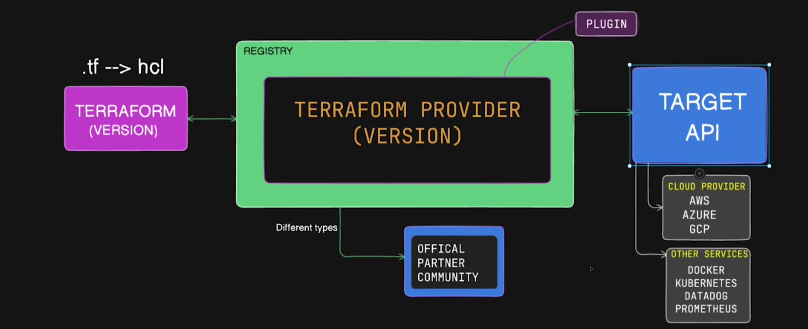
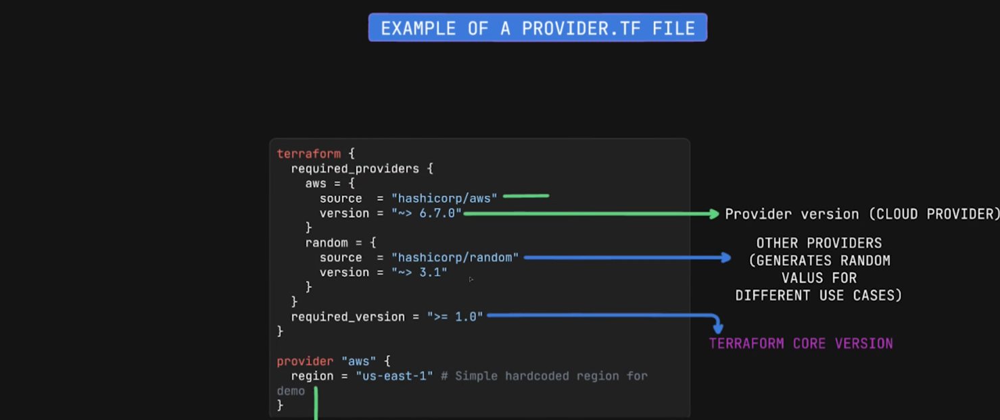
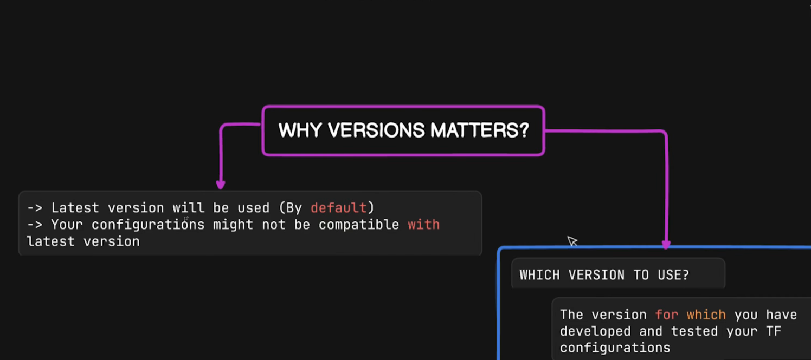
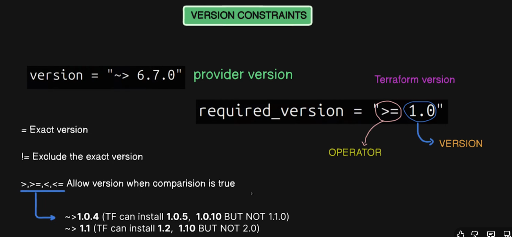

## Terraform AWS Provider

# Cloud Providers
- We write the infra code in HCL in *.tf files that cloud provider don't understant.
- So, we use cloud providers pluggins that HCL-code of terraform files to a language that cloud providers understand.
- When we do (terraform init), it downloads the terraform provider.

- There are various kinds of providers -> official(aws, azure, gcp), partner(maintained by third party) and community provider(maintained by open source community).





- "Random Provider" is given by Harshicorp to genereate unique strings that we can for diffrent use-cases.

- We should not hard code the values in the provider.tf file for security purpose.



- We have terraform version and provider version.
- Terraform binary and version are maintained by Harshicorp separately from providers(aws provider is maintained by aws community).
- So, we need to lock the versions of terraform providers and terraform to avoid the compatibility issues.



version = "~>1.0.3" then, (1.0.4,...,1.0.9) are acceptable but not (1.1.0, 1.2.0). 

# to authenticate the aws_provider
# Create IAM User with Full S3 Access + Access Keys

## 1. Create IAM User
1. Open **IAM** in the AWS Console.
2. Go to **Users → Create user**.
3. Enter a username.
4. Click **Next**.

## 2. Attach Full S3 Access
5. Choose **Attach policies directly**.
6. Select **AmazonS3FullAccess**.
7. Click **Create user**.

## 3. Generate Access Keys
8. Open the created user → **Security credentials**.
9. Under **Access keys**, click **Create access key**.
10. Select use case → **Create access key**.
11. Download or copy the **Access Key ID** and **Secret Access Key**.
 
- on terminal
1. aws configure
AWS Access Key ID: <your-access-key>
AWS Secret Access Key: <your-secret-key>
Default region name: <e.g., us-east-1>
Default output format: <json/text/table>

- terraform plan -> will compare .tf file configurations with actual environment to which we have authenticated.
- we can create only those resources for which we have given permission in the Attach Policy.
- Here, while creating the IAM user, I gave permission for s3-bucket so, I can create/manage the s3-bucket only.


------------------------------------------------------------------------------------------------------------------------------------
# Key Learning Points – Terraform Providers (Detailed Explanation)

## 📘 What Are Terraform Providers?
Terraform **providers** are plugins that enable Terraform to interact with external platforms such as AWS, Azure, Google Cloud, GitHub, Kubernetes, and various SaaS APIs.

Each provider:
- Exposes resources (e.g., `aws_instance`, `aws_vpc`)
- Exposes data sources (e.g., `aws_ami`)
- Handles authentication and API communication

For AWS usage, we rely on the official **`hashicorp/aws`** provider.

---

## 🔧 Provider vs Terraform Core Version

### **Terraform Core**
- The main Terraform binary you download and install.
- Responsible for:
  - Parsing `.tf` configuration files  
  - Building execution plans  
  - Managing state  
  - Executing CRUD operations defined in providers  

### **Provider Version**
- Separate plugin installed automatically when running `terraform init`
- Responsible for interacting with specific cloud/service APIs
- Each provider (AWS, Azure, GCP, GitHub, etc.) has its own:
  - Versioning  
  - Release cycle  
  - Feature set  

### ❗ Why They Matter Separately
Terraform Core and Providers **evolve independently**, so compatibility and version pinning are essential.

---

## 🎯 Why Provider Version Matters

1. **Compatibility**  
   Ensures the provider version works with your Terraform version.

2. **Stability**  
   Pinning versions prevents accidental upgrades that may break configurations.

3. **Feature Availability**  
   New AWS services/resources often appear only in newer provider versions.

4. **Bug & Security Fixes**  
   Providers release fixes regularly.

5. **Reproducibility**  
   All environments behave the same when provider versions are pinned.

---

## 🔒 Version Constraints

Used inside the `required_providers` block to control acceptable versions.

| Constraint | Meaning |
|-----------|---------|
| `= 1.2.3` | Exact version only |
| `>= 1.2` | Version 1.2 or higher |
| `<= 1.2` | Version 1.2 or lower |
| `~> 1.2` | Pessimistic: allows patch updates (`1.2.x`) but not minor upgrades |
| `>= 1.2, < 2.0` | Version between 1.2 and below 2.0 |

### ✔ Pessimistic Constraint Example
`~> 5.0` means:
- Allow 5.0.x, 5.1.x, 5.x.x  
- Do **not** allow 6.x (breaking changes)

---

## 🧠 Best Practices for Provider Versioning

1. **Always specify provider versions** to avoid unexpected changes.  
2. Use **pessimistic constraints (`~>`)** for safe upgrades.  
3. **Test provider upgrades** in dev/test before production.  
4. Document version requirements inside your project’s `README.md`.  
5. Use:  
   ```sh
   terraform providers lock
