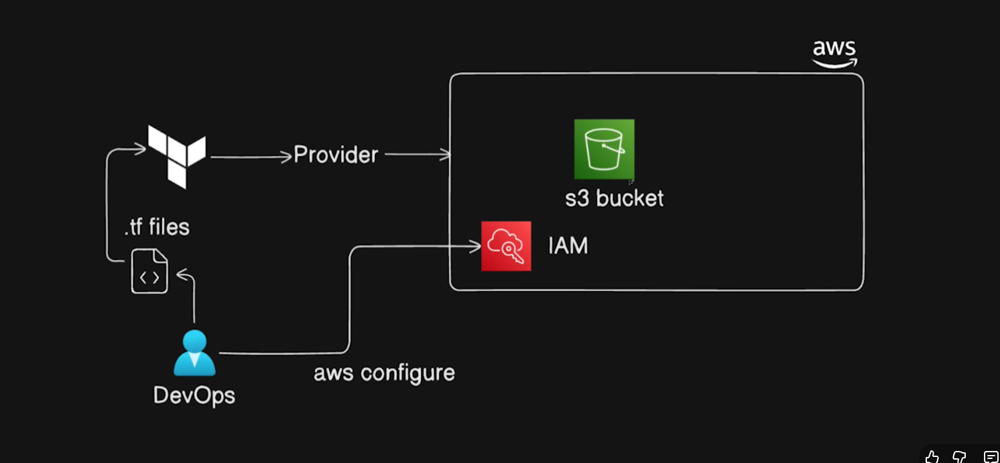

## Day-3  Create an AWS S3 Bucket Using Terraform




- terraform -help
- terraform init -upgrade
- terraform plan
- terraform apply (to apply the changes)
- terraform apply --auto-approve (to automatically approve the creating of resources)


# README: Terraform – Authentication, VPC Provisioning, and S3 Bucket Management

## 1. Overview

This document explains how Terraform authenticates with AWS, how VPCs and S3 buckets work, and how the provided Terraform configuration provisions these resources with implicit dependencies. Everything is described in a clear, ordered manner so beginners can follow the flow from authentication → resource creation → dependency handling.

---

## 2. Authentication and Authorization in AWS

To allow Terraform to interact with AWS, you must authenticate Terraform using valid AWS credentials.

### How Terraform Authenticates with AWS

Terraform uses the **AWS provider**, which depends on your local AWS credentials. These credentials can come from:

* **AWS CLI configuration** (most common)
* **Environment variables**
* **Shared credentials file** (`~/.aws/credentials`)
* **IAM roles** (when using EC2, ECS, etc.)

### Required IAM Permissions

To provision a VPC and S3 bucket, credentials must belong to a user/role with permissions like:

* `ec2:CreateVpc`
* `ec2:Describe*`
* `s3:CreateBucket`
* `s3:PutBucketTagging`

Terraform does not bypass AWS security; it follows AWS IAM rules strictly.

---

## 3. Understanding AWS VPC

A **VPC (Virtual Private Cloud)** is a private network inside AWS where you provision your infrastructure resources such as EC2 instances, subnets, route tables, and more.

Key characteristics:

* You define the **CIDR block** (IP range).
* AWS allocates the private network only to your account.
* You can customize networking and access controls.
* Acts as an isolated environment for your AWS services.

In this project, the VPC uses:

```
10.0.0.0/16
```

which provides up to 65,536 private IP addresses.

---

## 4. Understanding Amazon S3

Amazon S3 (Simple Storage Service) is a fully managed object storage service. It is commonly used for:

* File storage
* Backups
* Logging
* Hosting static websites
* Data lakes

### Bucket Naming

S3 bucket names must be **globally unique** across all AWS accounts. This is why random IDs are often appended.

### Tags

Tags help identify resources and enable cost allocation.

---

## 5. Terraform Code Breakdown

Below is the full Terraform configuration you provided, with an explanation of each part.

### Terraform Block

Specifies the AWS provider and its version:

```hcl
terraform {
  required_providers {
    aws = {
      source  = "hashicorp/aws"
      version = "~> 6.0"
    }
  }
}
```

### AWS Provider Configuration

Defines the region where resources will be created:

```hcl
provider "aws" {
  region = "ap-south-1"
}
```

---

## 6. Creating a Unique Random ID

Terraform generates a unique hex string that will be appended to the S3 bucket name.

```hcl
resource "random_id" "suffix" {
  byte_length = 4
}
```

This ensures the bucket name never conflicts with an existing bucket.

---

## 7. S3 Bucket (bucket1)

Creates an S3 bucket using the random ID suffix.

```hcl
resource "aws_s3_bucket" "bucket1" {
  bucket = "bucket1-${random_id.suffix.hex}"

  tags = {
    Name        = "My bucket 2.0"
    Environment = "Dev"
  }
}
```

This bucket has no relationship with the VPC; it stands alone.

---

## 8. Creating a VPC

```hcl
resource "aws_vpc" "main_vpc" {
  cidr_block = "10.0.0.0/16"

  tags = {
    Name        = "main_vpc"
    Environment = "Dev"
  }
}
```

This creates a custom VPC where future infrastructure components can be deployed.

---

## 9. S3 Bucket with Implicit Dependency (bucket2)

Terraform automatically builds dependency order by **referencing attributes** of other resources.

Here, the bucket name and tag both reference the VPC ID:

```hcl
resource "aws_s3_bucket" "bucket2" {
  bucket = "bucket12345-${aws_vpc.main_vpc.id}"  

  tags = {
    Name        = "bucket2"
    VpcLinkedTo = aws_vpc.main_vpc.id
  }
}
```

### Why This Creates an Implicit Dependency

Terraform sees:

```
${aws_vpc.main_vpc.id}
```

inside the S3 bucket.

So Terraform automatically ensures:

**VPC is created → THEN bucket2 is created**

This avoids using manual `depends_on`, which is recommended.

---

## 10. Output Section

Displays IDs of created resources after `terraform apply`:

```hcl
output "resource_ids" {
  value = {
    vpc_id        = aws_vpc.main_vpc.id
    s3_bucket_id  = aws_s3_bucket.bucket2.id
  }
}
```

---

## 11. Summary

This Terraform project demonstrates:

* How Terraform authenticates to AWS using credentials
* How to provision a VPC
* How to create two S3 buckets (one normal and one dependent)
* How implicit dependencies work through attribute references
* How outputs help verify created resource IDs

This forms the foundation for more advanced infrastructure such as subnets, route tables, EC2 instances, IAM roles, and secure bucket policies.

You can now expand this into modules, variable files, and a complete architecture as we continue building.
