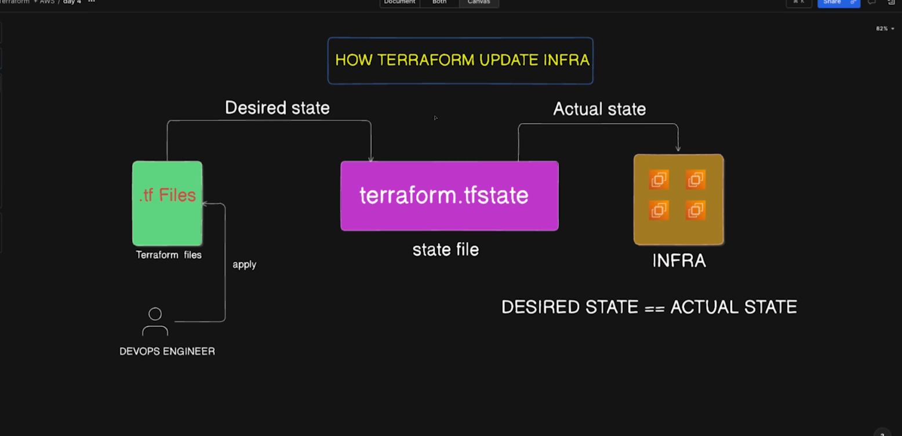
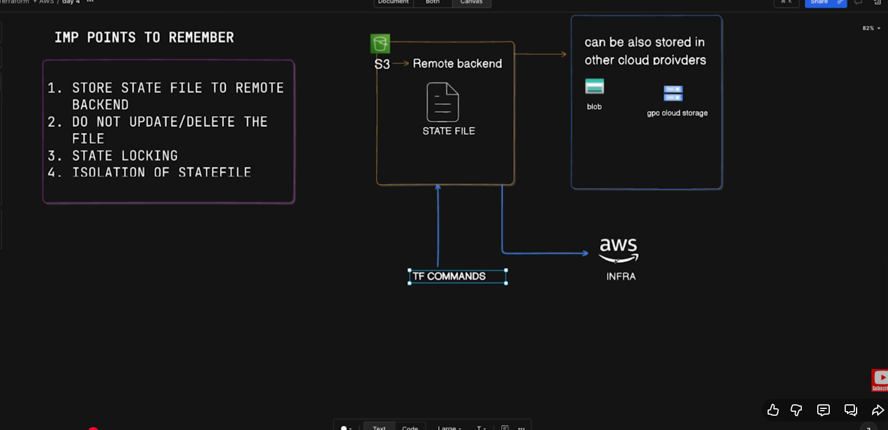

## Day-4 | Terraform State file management with AWS S3 | Remote Backend




# State Locking
- once the terraform state-file is used by a process then, don't use it elsewhere.
- Multiple users can't execute 'terraform plan' on the same infrastructure at the same time.
- It will lock the terraform state-file and once the command and the process is completed only then, it will release the lock on the state file so that it can be used by other processes.
- Earlier, we used to use dyanamoDB for state locking but it is deprecated now.
- We use S3-bucket for the state locking because it has inbuilt feature for it.
- State files are isolated as per the departments/environments(dev, test, prod) and make sure to perform regular backup of the state-files.

- terraform state list -> to list the resources in the state file


## Key Learning Points

### How Terraform Updates Infrastructure

* **Goal:** Ensure the actual state matches the desired state.
* **State File:** Terraform stores actual state in `terraform.tfstate`.
* **Process:** Terraform compares the current state with the desired configuration.
* **Updates:** Only resources that require changes are modified.

---

## Terraform State File

The Terraform state file (`terraform.tfstate`) is a JSON file containing:

* Resource metadata and configuration
* Resource dependencies
* Provider details
* Resource attribute values

---

## State File Best Practices

* Never edit the state file manually
* Store state **remotely**, not locally
* Enable **state locking** to prevent concurrent modifications
* Backup state files regularly
* Use separate state files for different environments
* Restrict access to state files (contains sensitive data)
* Encrypt state files at rest and in transit

---

## Remote Backend Benefits

* **Collaboration:** Shared state among team members
* **Locking:** Prevents multiple updates at once
* **Security:** Encrypted storage and controlled access
* **Backup:** Automatic versioning and recovery
* **Durability:** Highly available and resilient

---

## AWS Remote Backend Components

* **S3 Bucket** for state storage
* **S3 Native State Locking** using conditional writes (*Terraform 1.10+*)
* **IAM Policies** to control backend access

---

## S3 Native State Locking

### What is S3 Native State Locking?

Starting with **Terraform 1.10 (2024+)**, Terraform supports **native locking using S3**.
You no longer need DynamoDB for state locking.

### How It Works

S3 conditional writes (`If-None-Match`) are used to create a `.tflock` file:

1. Terraform attempts to create a lock file
2. S3 checks if it already exists
3. If it exists → Locking fails
4. If not → Lock acquired
5. After operation → Lock file deleted (versioned delete marker)

### Previous Method: DynamoDB Locking

* Required creating a DynamoDB table
* More complex IAM setup
* Additional cost
* Now discouraged and may be deprecated

---

## Tasks for Practice

### 1. Setup Remote Backend

#### Step 1: Create S3 Bucket for State Storage

Enable:

* **Versioning**
* **Server-side encryption**

You can automate this using the `test.sh` script (if provided).

#### Backend Configuration Example

```hcl
terraform {
  backend "s3" {
    bucket       = "your-terraform-state-bucket"
    key          = "dev/terraform.tfstate"
    region       = "us-east-1"
    use_lockfile = true
    encrypt      = true
  }
}
```

**Key Parameters**

* `bucket` – S3 bucket name
* `key` – Path to the state file
* `region` – AWS region
* `use_lockfile` – Enables S3 native locking
* `encrypt` – Encrypt state file

> **Important:** S3 versioning must be enabled for state locking.

---

## How to Test S3 State Locking

**Terminal 1**

```
terraform apply
```

**Terminal 2 (while apply is running)**

```
terraform plan
```

### Expected Error

```
Error: Error acquiring the state lock
Error message: operation error S3: PutObject, StatusCode: 412
```

### What Happens

* `.tflock` appears in S3
* After operation, it’s removed (delete marker)

---

## Backend Migration

```
terraform init
```

Terraform will prompt:

* Migrate existing state to new backend → Type **yes**

Verify:

```
terraform state list
```

---

## Useful Terraform State Commands

### List resources in state

```
terraform state list
```

### Show attributes of a resource

```
terraform state show <resource_name>
```

### Remove resource from state (without deleting)

```
terraform state rm <resource_name>
```

### Move a resource address

```
terraform state mv <source> <destination>
```

### Pull raw state content

```
terraform state pull
```

---

## Security Considerations

* Restrict S3 bucket access
* Make sure **versioning is enabled**
* Enable **S3 encryption** (SSE-S3 or SSE-KMS)
* Enable **CloudTrail logging**
* Use **least privilege IAM policies**
* No DynamoDB permissions required for native locking

---

## Common Issues & Fixes

### 1. State Lock Stuck

If Terraform crashes:

```
terraform force-unlock <lock-id>
```

Or manually delete `.tflock` from S3.

### 2. Permission Errors

Verify S3 read/write/list permissions.

### 3. Versioning Not Enabled

Locking will not work without versioning.

### 4. Region Mismatch

Backend region must match S3 bucket region.

### 5. Bucket Name Conflicts

S3 bucket names must be globally unique.

### 6. Terraform Version

Requires **Terraform 1.10+** for S3 native locking
(1.11+ recommended)


