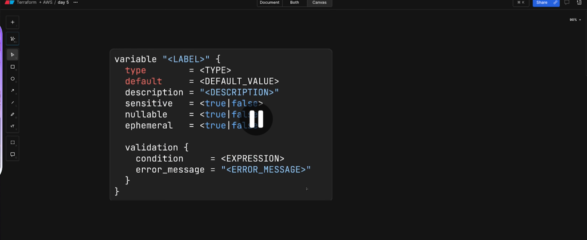
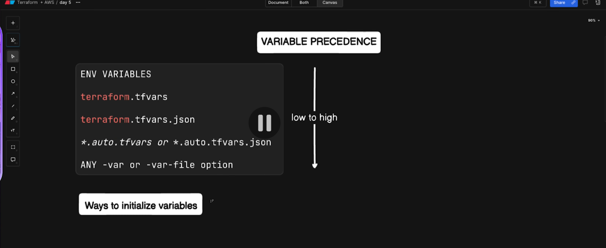

## Day-5 | Terraform Variables in AWS - Input vs Output vs Local Variables 

- Instead of hardcoding the values everytime, we create variables to store those values and use in the code.
- If we need to update the values in the code, we just update the variable instead of updating the code everywhere the variable is used.


- values of the output variables are populated when the resources have been created.




- environment variable has the higher precedence the input/local variables
- export TF_VAR_environment=stage

# precedence of varialbe initialization from low to high

- default < export TF_VAR_environment=stage < terraform.tfvars < terraform.tfvars.json < -var=environment=prod/-var-file option


---

## Three Types of Variables

### 1. Input Variables (variables.tf)

Input variables allow you to customize your Terraform configuration without hardcoding values.

Example:

```hcl
variable "environment" {
  description = "Environment name"
  type        = string
  default     = "staging"
}
```

---

### 2. Local Variables (locals.tf)

Local variables store computed or reusable values inside Terraform.

```hcl
locals {
  common_tags = {
    Environment = var.environment
    Project     = "Terraform-Demo"
  }

  full_bucket_name = "${var.environment}-${var.bucket_name}-${random_string.suffix.result}"
}
```

---

### 3. Output Variables (output.tf)

Output variables display useful values after Terraform creates the infrastructure.

```hcl
output "bucket_name" {
  description = "Name of the S3 bucket"
  value       = aws_s3_bucket.demo.bucket
}
```

---

# Input Variables in Detail

### What Are Input Variables?

Input variables act like function parameters. They allow you to pass values to Terraform, making your configuration reusable and flexible.

---

### Basic Structure

```hcl
variable "variable_name" {
  description = "Purpose of the variable"
  type        = string
  default     = "default_value"
}
```

---

### Defining and Using Input Variables

#### variables.tf

```hcl
variable "environment" {
  description = "Environment name"
  type        = string
  default     = "staging"
}

variable "bucket_name" {
  description = "S3 bucket name"
  type        = string
  default     = "my-terraform-bucket"
}
```

#### main.tf

```hcl
resource "aws_s3_bucket" "demo" {
  bucket = var.bucket_name

  tags = {
    Environment = var.environment
  }
}
```

---

### Ways to Provide Input Variable Values

1. **Default values (in variables.tf)**
   Terraform uses default if no other value is provided.

2. **terraform.tfvars file**

   ```hcl
   environment = "demo"
   bucket_name = "terraform-demo-bucket"
   ```

3. **Command line**

   ```bash
   terraform plan -var="environment=production"
   ```

4. **Environment variables**

   ```bash
   export TF_VAR_environment="development"
   terraform plan
   ```

---

# Output Variables in Detail

### What Are Output Variables?

Output variables work like function return values. After deployment, they show important resource information.

---

### Basic Structure

```hcl
output "output_name" {
  description = "Details"
  value       = resource.resource_name.attribute
}
```

---

### Example Outputs

```hcl
output "bucket_name" {
  value = aws_s3_bucket.demo.bucket
}

output "bucket_arn" {
  value = aws_s3_bucket.demo.arn
}

output "environment" {
  value = var.environment
}

output "tags" {
  value = local.common_tags
}
```

---

### Viewing Outputs

```bash
terraform output                # Show all outputs
terraform output bucket_name    # Show one output
terraform output -json          # JSON formatted output
```

---

# What This Configuration Creates

A simple S3 bucket example that demonstrates:

* Input variables for environment and base bucket name
* Local variables to compute final bucket name and tags
* Output variables to display bucket details after deployment

---

# Variable Precedence

Highest priority to lowest:

1. Command line `-var`
2. `.tfvars` file
3. Environment variables
4. Default values in `variables.tf`

---

### Testing Precedence

1. Hide tfvars file:

   ```bash
   mv terraform.tfvars terraform.tfvars.backup
   terraform plan
   ```

2. Restore tfvars:

   ```bash
   mv terraform.tfvars.backup terraform.tfvars
   terraform plan
   ```

3. Command line overrides:

   ```bash
   terraform plan -var="environment=production"
   ```

4. Environment variable:

   ```bash
   export TF_VAR_environment="staging-from-env"
   terraform plan
   ```

5. Using specific tfvars files:

   ```bash
   terraform plan -var-file="dev.tfvars"
   terraform plan -var-file="production.tfvars"
   ```

---

# File Structure

```
├── main.tf
├── variables.tf
├── locals.tf
├── output.tf
├── provider.tf
├── terraform.tfvars
└── README.md
```

---

# Practical Examples

## Example 1: Testing Input Values

```bash
# Hide tfvars and test defaults
mv terraform.tfvars terraform.tfvars.backup
terraform plan

# Restore tfvars
mv terraform.tfvars.backup terraform.tfvars
terraform plan

# Command line override
terraform plan -var="environment=test" -var="bucket_name=my-test-bucket"
```

---

## Example 2: Viewing All Variable Types

```bash
terraform apply -auto-approve
terraform output

echo "Environment: $(terraform output -raw environment)"
echo "Full bucket name: $(terraform output -raw bucket_name)"
```

---

## Example 3: Precedence in Action

```bash
terraform plan | grep Environment

export TF_VAR_environment="from-env-var"
terraform plan | grep Environment

terraform plan -var="environment=from-command-line" | grep Environment

unset TF_VAR_environment
```

---

# Useful Commands

```bash
terraform init
terraform plan
terraform plan -var="environment=test"
terraform plan -var-file="dev.tfvars"
terraform apply
terraform output
terraform destroy
```

---

# Key Takeaways

* Input variables parameterize the configuration
* Local variables compute reusable values
* Output variables expose deployment information
* Precedence order ensures control over variable values

---
