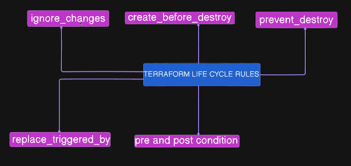

## Day 9 - AWS Terraform Lifecycle Rules Explained

- Terraform Lifecycle rules actually control the behaviour of how various resources are created, updated, or destroyed.
- This improve the security and accidental deletion/modification of infra.
- It improves the infra managebility and operations.



# 1. ignore_changes
- If it is enabled then, terraform will not do any changes on the resource about which we are talking about.

# 2. create_before_destroy
- When you make any destructive modification to the resource then, it makes sure that the new resource is recreated first then, destroy the older one. It ensure minimum downtime.

# 3. prevent_destroy
- This prevents the accidental deletion of resources. e.g. we can use it for the S3 bucket that stores the state-file to prevent the accidental deletion.
- If we are changing the ami-id this causes the resouces to be recreated and destroying the older one. So, this request is also blocked.

# 4. replace_triggered_by
- This manages the dependency between the resources. Like if we say if there is change in security group then, replace the older ec2 instance with the new one.

# 5. pre and post condition
- This allows to define the pre-checks before the creation of the resource and condition to be followed after the resource has been created.


--- 

## 1. create_before_destroy

### What it does
Forces Terraform to create a replacement resource before destroying the original resource.

### Default Behavior
Normally, Terraform destroys the old resource first, then creates the new one.

### Use Cases
- EC2 instances behind load balancers (zero downtime)
- RDS instances with read replicas
- Critical infrastructure that cannot have gaps
- Resources referenced by other infrastructure

### Example
```hcl
resource "aws_instance" "web_server" {
  ami           = data.aws_ami.amazon_linux_2.id
  instance_type = var.instance_type

  lifecycle {
    create_before_destroy = true
  }
}
````

### Benefits

* Prevents service interruption
* Maintains resource availability during updates
* Reduces deployment risks
* Enables blue-green deployments

### When NOT to use

* When resource naming must be unique and unchanging
* When you can afford downtime
* When you want to minimize costs (temporary duplicate resources)

---

## 2. prevent_destroy

### What it does

Prevents Terraform from destroying a resource. If destruction is attempted, Terraform will error.

### Use Cases

* Production databases
* Critical S3 buckets with important data
* Security groups protecting production resources
* Stateful resources that should never be deleted

### Example

```hcl
resource "aws_s3_bucket" "critical_data" {
  bucket = "my-critical-production-data"

  lifecycle {
    prevent_destroy = true
  }
}
```

### Benefits

* Protects against accidental deletion
* Adds safety layer for critical resources
* Prevents data loss
* Enforces manual intervention for deletion

### How to Remove

1. Comment out `prevent_destroy = true`
2. Run `terraform apply` to update the state
3. Now you can destroy the resource

### When to use

* Production databases
* State files storage
* Compliance-required resources
* Resources with important data

---

## 3. ignore_changes

### What it does

Tells Terraform to ignore changes to specified resource attributes. Terraform will not try to revert these changes.

### Use Cases

* Auto Scaling Group capacity (managed by auto-scaling policies)
* EC2 instance tags (added by monitoring tools)
* Security group rules (managed by other teams)
* Database passwords (managed via Secrets Manager)

### Example

```hcl
resource "aws_autoscaling_group" "app_servers" {
  desired_capacity = 2

  lifecycle {
    ignore_changes = [
      desired_capacity,
      load_balancers,
    ]
  }
}
```

### Special Values

* `ignore_changes = all`
* `ignore_changes = [tags]`

### Benefits

* Prevents configuration drift issues
* Allows external systems to manage certain attributes
* Reduces Terraform plan noise
* Enables hybrid management approaches

### When to use

* Resources modified by auto-scaling
* Attributes managed by external tools
* Frequently changing values
* Values managed outside Terraform

---

## 4. replace_triggered_by

### What it does

Forces resource replacement when specified dependencies change, even if the resource itself has not changed.

### Use Cases

* Replace EC2 instances when security groups change
* Recreate containers when configuration changes
* Force rotation of resources based on other resource updates

### Example

```hcl
resource "aws_security_group" "app_sg" {
  name = "app-security-group"
}

resource "aws_instance" "app_with_sg" {
  ami           = data.aws_ami.amazon_linux_2.id
  instance_type = "t2.micro"
  vpc_security_group_ids = [aws_security_group.app_sg.id]

  lifecycle {
    replace_triggered_by = [
      aws_security_group.app_sg.id
    ]
  }
}
```

### Benefits

* Ensures consistency after dependency changes
* Forces fresh deployments
* Useful for immutable infrastructure patterns

### When to use

* When dependent resource changes require recreation
* For immutable infrastructure
* When you want forced resource rotation

---

## 5. precondition

### What it does

Validates conditions before Terraform attempts to create or update a resource. Errors if condition is false.

### Use Cases

* Validate deployment region is allowed
* Ensure required tags are present
* Check environment variables before deployment
* Validate configuration parameters

### Example

```hcl
resource "aws_s3_bucket" "regional_validation" {
  bucket = "validated-region-bucket"

  lifecycle {
    precondition {
      condition     = contains(var.allowed_regions, data.aws_region.current.name)
      error_message = "ERROR: Can only deploy in allowed regions: ${join(", ", var.allowed_regions)}"
    }
  }
}
```

### Benefits

* Catches errors before resource creation
* Enforces organizational policies
* Provides clear error messages
* Prevents invalid configurations

### When to use

* Enforce compliance requirements
* Validate inputs before deployment
* Ensure dependencies are met
* Check environment constraints

---

## 6. postcondition

### What it does

Validates conditions after Terraform creates or updates a resource. Errors if condition is false.

### Use Cases

* Ensure required tags exist after creation
* Validate resource attributes are correctly set
* Check resource state after deployment
* Verify compliance after creation

### Example

```hcl
resource "aws_s3_bucket" "compliance_bucket" {
  bucket = "compliance-bucket"

  tags = {
    Environment = "production"
    Compliance  = "SOC2"
  }

  lifecycle {
    postcondition {
      condition     = contains(keys(self.tags), "Compliance")
      error_message = "ERROR: Bucket must have a 'Compliance' tag!"
    }

    postcondition {
      condition     = contains(keys(self.tags), "Environment")
      error_message = "ERROR: Bucket must have an 'Environment' tag!"
    }
  }
}
```

### Benefits

* Verifies resource was created correctly
* Ensures compliance after deployment
* Catches configuration issues post-creation
* Validates resource state

### When to use

* Verify resource meets requirements after creation
* Ensure tags or attributes are set correctly
* Check resource state post-deployment
* Validate compliance requirements

---

# Common Patterns

### Pattern 1: Database Protection

Combine `prevent_destroy` with `create_before_destroy` for RDS instances.

### Pattern 2: Auto-Scaling Integration

Use `ignore_changes` for attributes managed by AWS services.

### Pattern 3: Immutable Infrastructure

Use `replace_triggered_by` for configuration-driven deployments.

---

# Best Practices

* Use `create_before_destroy` for critical resources
* Apply `prevent_destroy` to production data stores
* Document all lifecycle customizations
* Test lifecycle behaviors in development first
* Be cautious with `ignore_changes` as it can hide important changes

### Common Mistakes

* Forgetting dependencies when using `create_before_destroy`
* Over-using `ignore_changes` and missing important updates
* Not testing lifecycle rules before applying to production

---
